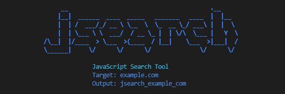

# jsearch - JavaScript Search Tool

<div align="center">



**A comprehensive subdomain discovery and JavaScript analysis tool**

[](https://www.python.org/downloads/)
[](https://opensource.org/licenses/MIT)

</div>

## 🔍 Overview

jsearch is an automated reconnaissance tool designed for bug bounty hunters and penetration testers. It combines multiple powerful tools to perform comprehensive subdomain discovery, live domain verification, JavaScript file extraction, and secret analysis in a streamlined workflow.

## ✨ Features

- **Subdomain Discovery**: Uses subfinder and ffuf with comprehensive wordlists
- **Live Domain Verification**: Validates discovered subdomains using httpx
- **JavaScript File Discovery**: Extracts JS files using gau and katana
- **Secret Analysis**: Analyzes JavaScript files for potential secrets using mantra
- **Vulnerability Scanning**: Optional nuclei integration for vulnerability detection
- **Duplicate Prevention**: Automatically removes duplicates across different tools
- **Comprehensive Reporting**: JSON output with detailed results

## 📦 Installation

### Kali Linux / Ubuntu / Debian
```bash
# 1. Clone the repository
git clone https://github.com/karlvidar/jsearch.git
cd jsearch

# 2. Make executable
chmod +x jsearch.py

# 3. Create global alias
cd ..
echo "alias jsearch='python3 $(pwd)/jsearch/jsearch.py'" >> ~/.bashrc
source ~/.bashrc

# 4. Test the installation
jsearch --help
```

### macOS
```bash
# 1. Clone the repository
git clone https://github.com/karlvidar/jsearch.git
cd jsearch

# 2. Make executable
chmod +x jsearch.py

# 3. Create global alias (for bash)
cd ..
echo "alias jsearch='python3 $(pwd)/jsearch/jsearch.py'" >> ~/.bash_profile
source ~/.bash_profile

# For zsh users (default on newer macOS)
echo "alias jsearch='python3 $(pwd)/jsearch/jsearch.py'" >> ~/.zshrc
source ~/.zshrc

# 4. Test the installation
jsearch --help
```

### Windows
```powershell
# 1. Clone the repository
git clone https://github.com/karlvidar/jsearch.git
cd jsearch

# 2. Run directly
python jsearch.py -u example.com
```

## 🛠️ Install Required Tools

After installing jsearch, you need to install the reconnaissance tools:

### Kali Linux / Ubuntu / Debian
```bash
# Install Go
sudo apt update
sudo apt install golang-go

# Install Go tools
go install -v github.com/projectdiscovery/subfinder/v2/cmd/subfinder@latest
go install github.com/ffuf/ffuf@latest
go install github.com/lc/gau/v2/cmd/gau@latest
go install -v github.com/projectdiscovery/httpx/cmd/httpx@latest
go install -v github.com/projectdiscovery/katana/cmd/katana@latest
go install -v github.com/projectdiscovery/nuclei/v2/cmd/nuclei@latest

# Install mantra (brosck version)
git clone https://github.com/brosck/mantra.git
cd mantra
pip install -r requirements.txt
sudo cp mantra /usr/local/bin/
cd ..

# Install wordlists
sudo apt install seclists
```

### macOS
```bash
# Install Go
brew install go

# Install Go tools (same as above)
go install -v github.com/projectdiscovery/subfinder/v2/cmd/subfinder@latest
go install github.com/ffuf/ffuf@latest
go install github.com/lc/gau/v2/cmd/gau@latest
go install -v github.com/projectdiscovery/httpx/cmd/httpx@latest
go install -v github.com/projectdiscovery/katana/cmd/katana@latest
go install -v github.com/projectdiscovery/nuclei/v2/cmd/nuclei@latest

# Install mantra (brosck version)
git clone https://github.com/brosck/mantra.git
cd mantra
pip install -r requirements.txt
sudo cp mantra /usr/local/bin/
cd ..

# Install wordlists manually
git clone https://github.com/danielmiessler/SecLists.git /usr/local/share/wordlists/seclists
```

## 🚀 Usage

### Basic Usage

```bash
jsearch -u example.com
```

### Advanced Usage

```bash
# Specify custom output directory
jsearch -u example.com -p /tmp/bug_bounty_results

# Save results to specific file
jsearch -u example.com -o results.json
```

### Command Line Options

| Option | Description | Example |
|--------|-------------|---------|
| `-u, --url` | Target domain (required) | `-u example.com` |
| `-p, --path` | Custom output directory | `-p /tmp/results` |
| `-o, --output` | Output file for results | `-o results.json` |
| `-h, --help` | Show help message | `-h` |

## 📊 Output Structure

JSearch creates a structured output directory containing:

```
jsearch_example_com/
├── subfinder_results.txt      # Subfinder discoveries
├── ffuf_results.json         # Ffuf fuzzing results
├── live_domains.txt          # Live domain verification
├── gau_js_files.txt          # JS files from gau
├── katana_js_files.txt       # JS files from katana (if available)
├── mantra_secrets.txt        # Secret analysis results
├── nuclei_results.txt        # Vulnerability scan results (if available)
└── jsearch_summary.json      # Consolidated summary
```

### Summary JSON Format
```json
{
  "target": "example.com",
  "timestamp": "2025-08-06T10:30:00",
  "subdomains_found": 150,
  "live_domains_found": 75,
  "js_files_found": 230,
  "subdomains": [...],
  "live_domains": [...],
  "js_files": [...]
}
```

## 🔧 Configuration

### Wordlist Configuration
By default, JSearch uses:
```
/usr/share/wordlists/seclists/Discovery/DNS/bug-bounty-program-subdomains-trickest-inventory.txt
```

To use a custom wordlist, modify the `wordlist_path` variable in `jsearch.py`.

### Tool Timeouts and Threads
You can adjust the following parameters in the script:
- `timeout`: Command timeout (default: 300 seconds)
- `httpx threads`: Concurrent threads for httpx (default: 50)
- `ffuf threads`: Concurrent threads for ffuf (default: 50)

## 🎨 Features in Detail

### 1. Subdomain Discovery
- **Subfinder**: Passive subdomain enumeration using multiple sources
- **Ffuf**: Active subdomain fuzzing with comprehensive wordlists
- **Duplicate Removal**: Automatically merges results without duplicates

### 2. Live Domain Verification
- **Httpx**: Fast HTTP probe to verify live subdomains
- **Timeout Management**: Configurable timeouts for reliability
- **Status Code Filtering**: Focuses on responsive domains

### 3. JavaScript File Discovery
- **Gau**: GetAllUrls for historical JS file discovery
- **Katana**: Modern web crawler for additional JS files
- **Filtering**: Automatically filters for .js files only

### 4. Secret Analysis
- **Mantra**: Analyzes JS files for API keys, tokens, and secrets
- **Pattern Matching**: Uses advanced regex patterns for detection
- **Reporting**: Clear output of potential security issues

### 5. Vulnerability Scanning (Optional)
- **Nuclei**: Community-powered vulnerability scanner
- **Template-based**: Uses extensive vulnerability templates
- **Severity Filtering**: Focuses on medium, high, and critical issues

## 🔍 Troubleshooting

### Alias Issues

**1. Aliases not working:**
```bash
# Check if aliases were added
grep "jsearch" ~/.bashrc  # For bash users
grep "jsearch" ~/.zshrc   # For zsh users (macOS)

# Reload configuration
source ~/.bashrc  # or source ~/.zshrc

# Or start a new terminal session
```

**2. "Command not found" error:**
```bash
# Test direct execution first
python3 /full/path/to/jsearch/jsearch.py --help

# Check if the path in your alias is correct
which python3

# Re-add the alias with correct path
echo "alias jsearch='python3 $(pwd)/jsearch/jsearch.py'" >> ~/.bashrc
source ~/.bashrc
```

### Tool Issues

**1. Tools not found**
```bash
# Check if tools are in PATH
which subfinder httpx ffuf gau

# Add Go bin to PATH if needed
echo 'export PATH="$PATH:$HOME/go/bin"' >> ~/.bashrc
source ~/.bashrc
```

**2. Permission denied**
```bash
chmod +x jsearch.py
```

**3. Wordlist not found**
```bash
# Install SecLists
sudo apt install seclists
# Or download manually
git clone https://github.com/danielmiessler/SecLists.git /usr/share/wordlists/seclists
```

**4. Mantra installation issues**
```bash
# If you get permission errors with mantra:
# Make sure you cloned the correct mantra repository
git clone https://github.com/brosck/mantra.git
cd mantra

# Install requirements
pip install -r requirements.txt

# Make mantra executable and copy to system PATH
chmod +x mantra
sudo cp mantra /usr/local/bin/

# Test mantra installation
mantra -h

# If still having issues, try adding to local bin
mkdir -p ~/.local/bin
cp mantra ~/.local/bin/
echo 'export PATH="$PATH:$HOME/.local/bin"' >> ~/.bashrc
source ~/.bashrc
```

**5. Timeout issues**
- Increase timeout values in the script for slow networks
- Reduce thread counts for stability